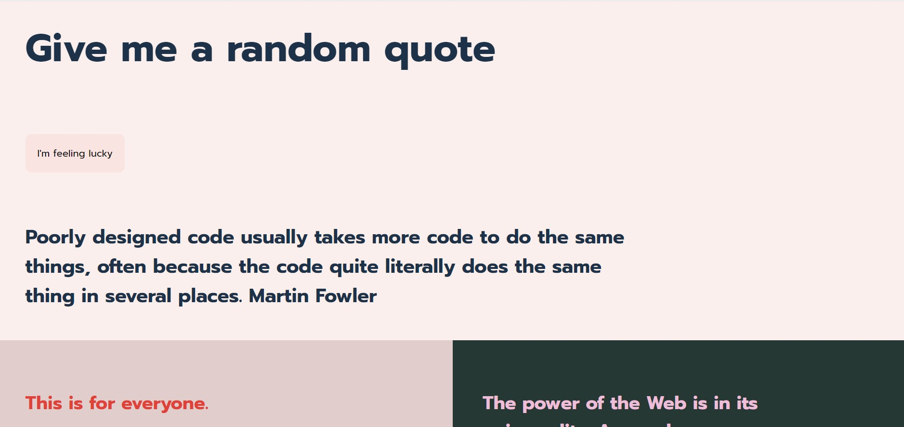

# Opdracht
Quotes for WAFS

# Week 1
In week 1 I choice my final project: Quotes. I went for Quotes because I'm a beginnner in Javascript. 
I did have experience in  XMLHttpRequest. So i choice that for getting data out of the API.

I started of with a design in XD containing:
https://xd.adobe.com/view/e0722e78-27ed-415c-a5e9-f74abe4743fe-b521/
- Zero state
- Ideal state
- Loading state
- Error state

The design of the ideal state I copied and turned into a breakdown sketch to deving al the HTML elements.
Then I went on on the creating these elements in my html, write some base css, and then starting early with my JS.
Because I in my JS im creating a lot of HTML elements i only use html for the header and the Root. 

Then by then end of the week I was left with my design, working JS loading in my API, making the elements responsive and even adding a extra options of generating a random quote.

.jpg)

