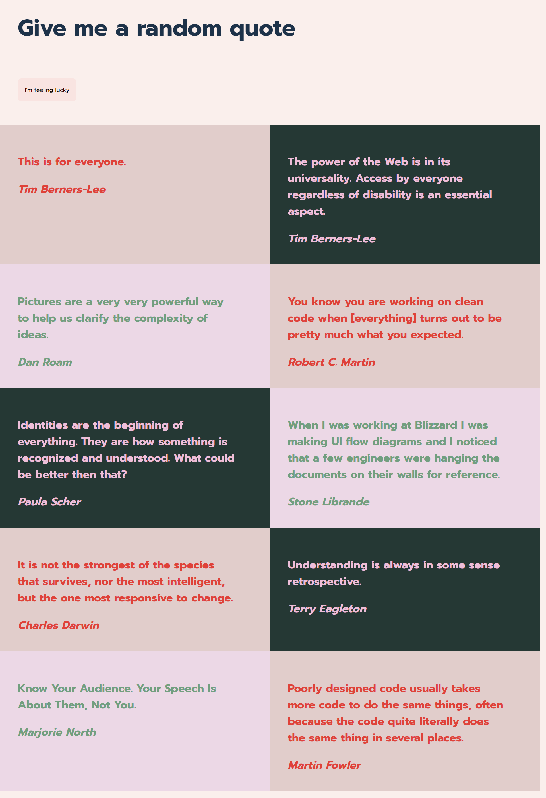

# Quotes 🪅


[ 🪅 Live link naar product](https://Fabienne02.github.io/Quotes/index.html)

# Introduction
Quotes is een web-app die je door inspireerde quotes laat scrollen.
Pin jouw favorite quotes of laat je verassen door de random quote generator!



## Table of contents
  - [Table of contents](#table-of-contents)
  - [Introduction](#introduction)
  - [About](#about)
  - [Gecodeerd met](#gecodeerd-met)
  - [Features](#features)
  - [Wishlist](#wishlist)
  - [Installing](#installing)
  - [Control flow](#control-flow)
  - [Documentation](#documentation)
  - [Sources](#sources)
  - [Author](#author)

## About
**Quotes is een webapp waar je geinspireerd kan worden door design quotes!**

Quotes maakt gebruik van een api: https://quote.api.fdnd.nl/v1/quote

## Gecodeerd met
Quotes is gecodeerd in HTML, CSS en Javascript, Hierbij maak ik gebruik van een hash router => [routie.js](http://projects.jga.me/routie/) 

## Features
<ul>
  <li>Geneer een random quote van de dag</li>
  <li>Focus op jouw favoriete quote</li>
</ul>

## Wishlist
<ul>
  <li>Deel jouw favoriete quote op twitter</li>
  <li>Voeg je eigen quotes toe aan de api</li>
</ul>

## Installing
1. Clone deze repository naar jouw lokale folder
```
git clone https://github.com/Fabienne02/Quotes.git
```
2. Open de folder in jouw code applicatie [Zoals VSCODE](https://code.visualstudio.com/Download)
3. Start een live port en bekijk het project in jouw browser

## Control flow


## Documentation
Lees hier mijn documentatie per week [wiki](https://github.com/Fabienne02/Quotes/wiki)

## Sources
- [Hash router](http://projects.jga.me/routie/)
- [Code hulp bron](https://developer.mozilla.org/en-US/)


## Author
De maker van deze app is: [*Fabienne van den Steen*](https://github.com/Fabienne02)


